# Diagrams Gallery

> Architecture diagrams for all migration paths.

---

## Common Architecture {#common-architecture}

### Simple Two-Hop Pattern

Tool-neutral architecture for documentation overviews:

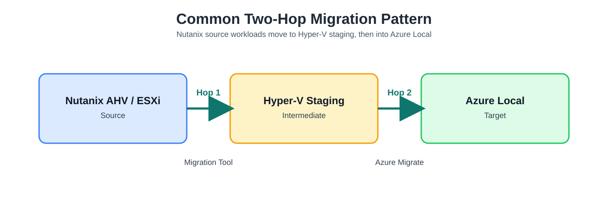

Nutanix AHV/ESXi (Source) → Hyper-V Staging (Intermediate) → Azure Local (Target)

### Common Two-Hop DrawIO Source

[`diagrams/common/migration-diagrams-common-two-hop.drawio`](../assets/diagrams/migration-diagrams-common-two-hop.drawio)

### Detailed Two-Hop Architecture

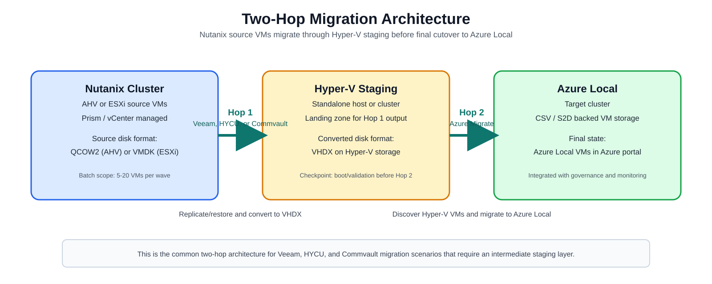

[`diagrams/common/migration-diagrams-common-two-hop-detailed.drawio`](../assets/diagrams/migration-diagrams-common-two-hop-detailed.drawio)

### Migration Phases Overview

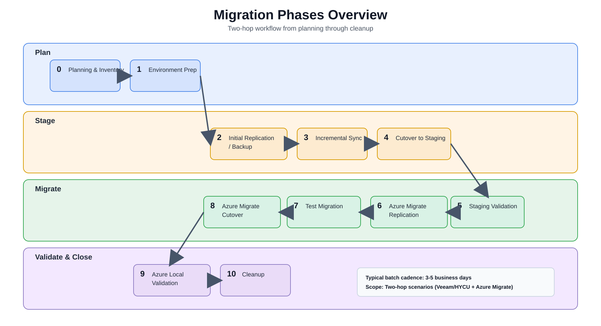

[`diagrams/overview/migration-diagrams-phases-overview.drawio`](../assets/diagrams/migration-diagrams-phases-overview.drawio)

### Tool Selection Flow

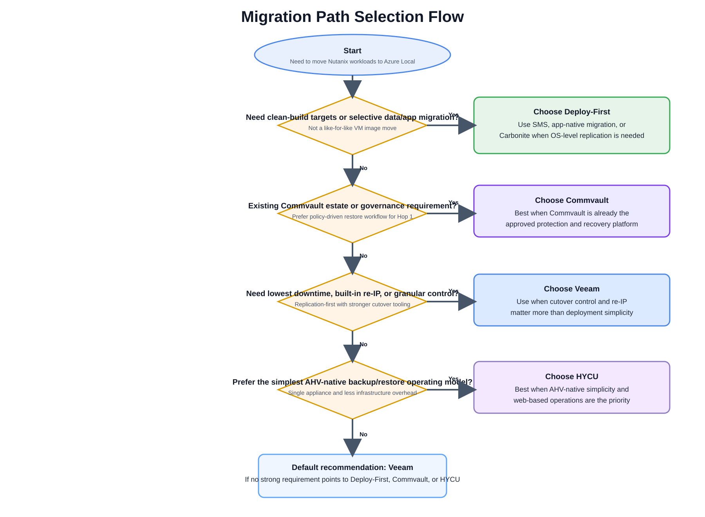

[`diagrams/overview/migration-diagrams-tool-selection-flow-four-path.drawio`](../assets/diagrams/migration-diagrams-tool-selection-flow-four-path.drawio)

---

## Veeam Migration Path {#veeam}

### Scenario page detailed architecture

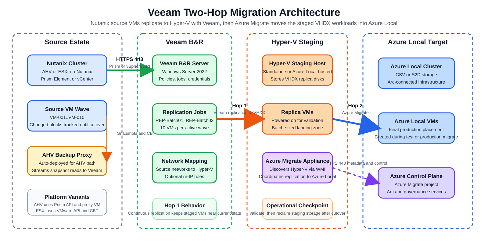

*Scenario-page component diagram: source Nutanix estate, Veeam B&R control plane, Hyper-V staging, Azure Migrate appliance, and Azure Local destination.*

[`diagrams/scenarios/01-veeam-architecture-detailed.drawio`](../assets/diagrams/01-veeam-architecture-detailed.drawio)

### High-Level Architecture

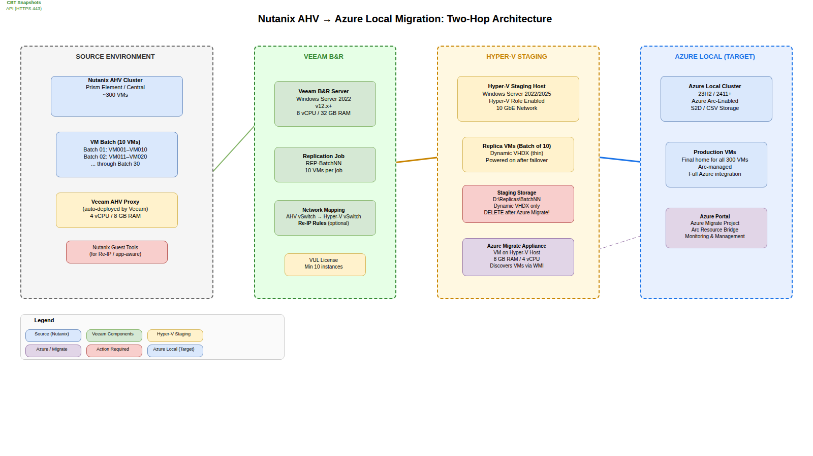

*Two-hop architecture: Nutanix AHV/ESXi → Veeam replication → Hyper-V staging → Azure Migrate → Azure Local.*

### Batch Pipeline Flow

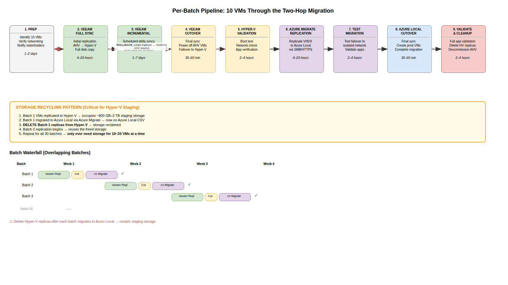

*Sequential batch execution — 10 VMs per batch, Hop 1 cutover before Hop 2 begins.*

### Veeam Setup Detail

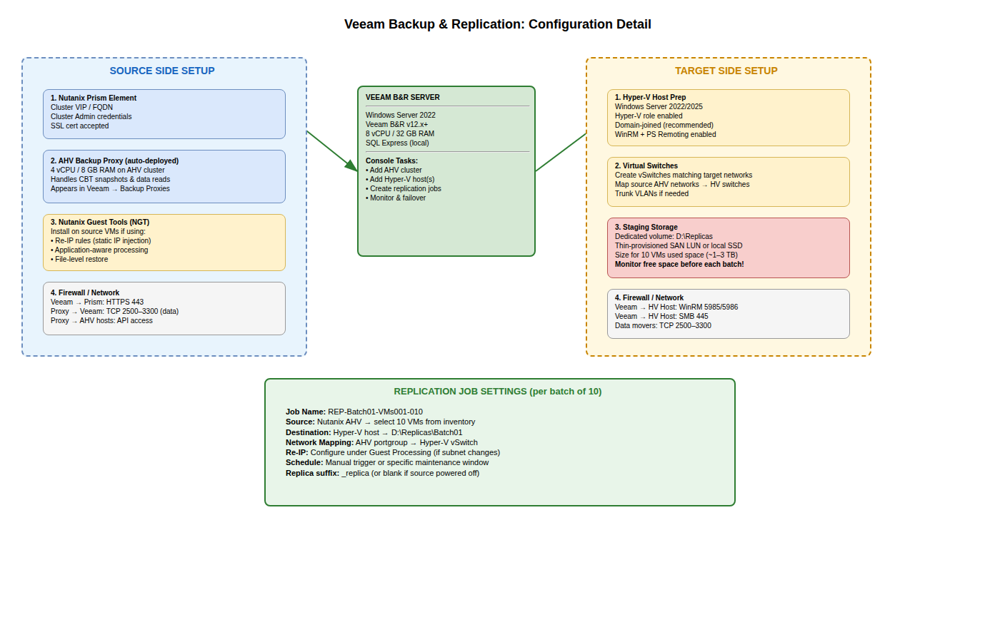

*Detailed component diagram: Veeam server, AHV proxy VM, replication jobs, Hyper-V target.*

### Azure Migrate Workflow

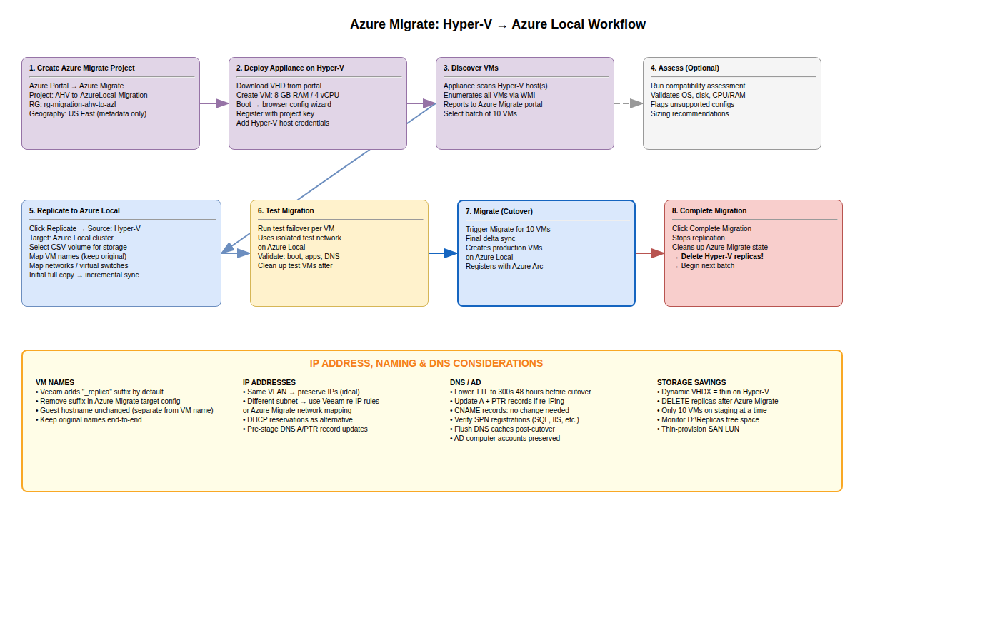

*Azure Migrate: appliance discovery → replication → test migration → production cutover → Azure Local VMs.*

### Veeam DrawIO Source

The editable DrawIO source for all Veeam diagrams:  
[`diagrams/veeam/migration-diagrams-veeam.drawio`](../assets/diagrams/migration-diagrams-veeam.drawio)

---

## HYCU Migration Path {#hycu}

### Scenario page detailed architecture

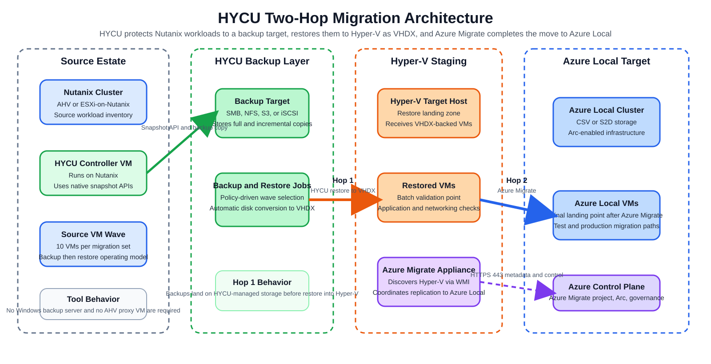

*Scenario-page component diagram: Nutanix source estate, HYCU controller and backup target, Hyper-V restore landing zone, Azure Migrate appliance, and Azure Local destination.*

[`diagrams/scenarios/02-hycu-architecture-detailed.drawio`](../assets/diagrams/02-hycu-architecture-detailed.drawio)

### HYCU Setup Detail

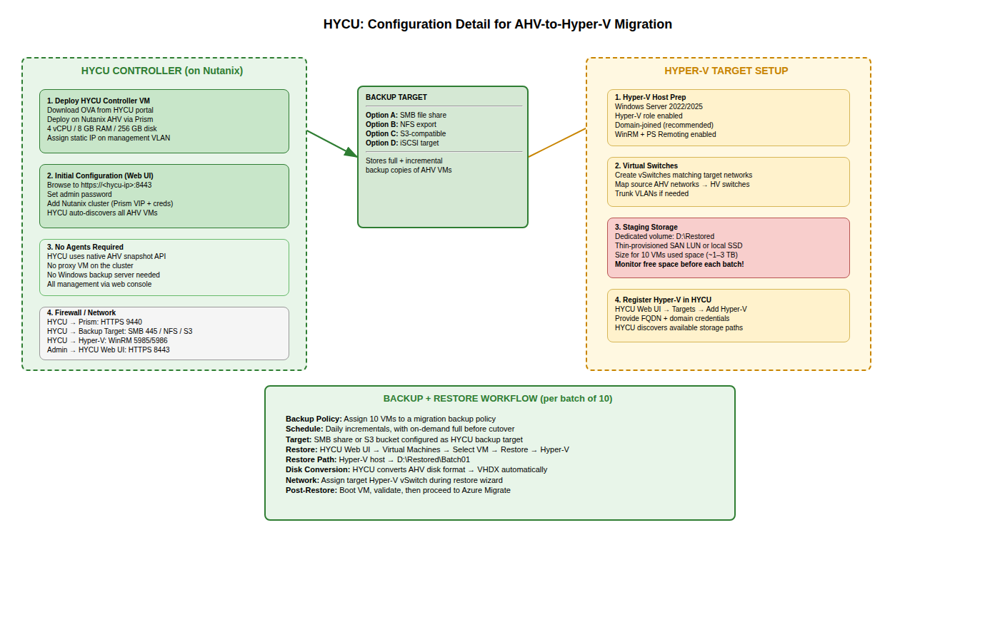

*HYCU controller VM on AHV, backup target, Hyper-V restore target, Azure Migrate.*

### HYCU DrawIO Source

[`diagrams/hycu/migration-diagrams-hycu.drawio`](../assets/diagrams/migration-diagrams-hycu.drawio)

---

## Commvault Migration Path {#commvault}

### Scenario page detailed architecture

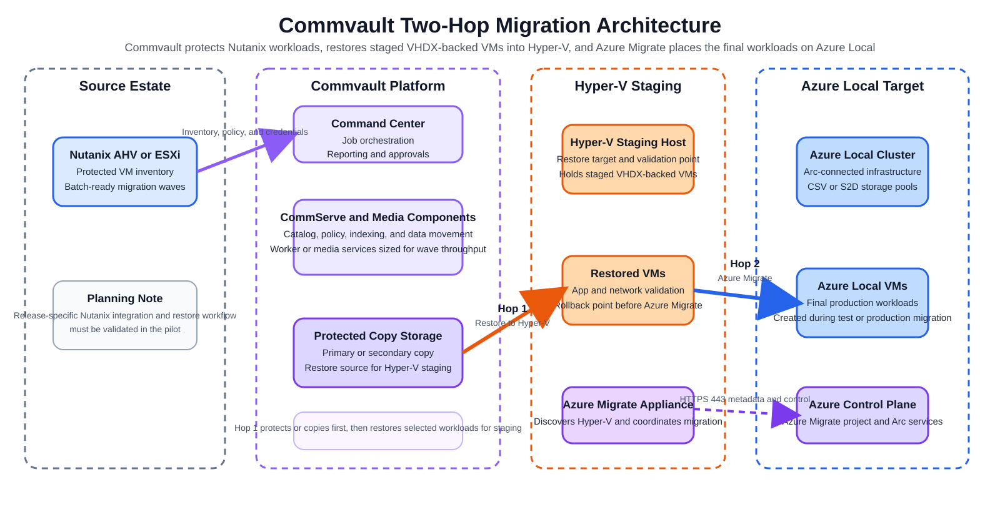

*Scenario-page component diagram: Nutanix source estate, Commvault control and copy layers, Hyper-V staging, Azure Migrate appliance, and Azure Local destination.*

[`diagrams/scenarios/03-commvault-architecture-detailed.drawio`](../assets/diagrams/03-commvault-architecture-detailed.drawio)

### High-Level Architecture

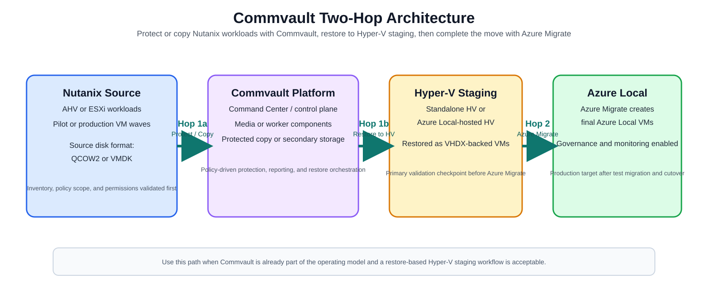

*Two-hop architecture: Nutanix AHV/ESXi → Commvault protected copy → Hyper-V staging → Azure Migrate → Azure Local.*

### Commvault Setup Detail

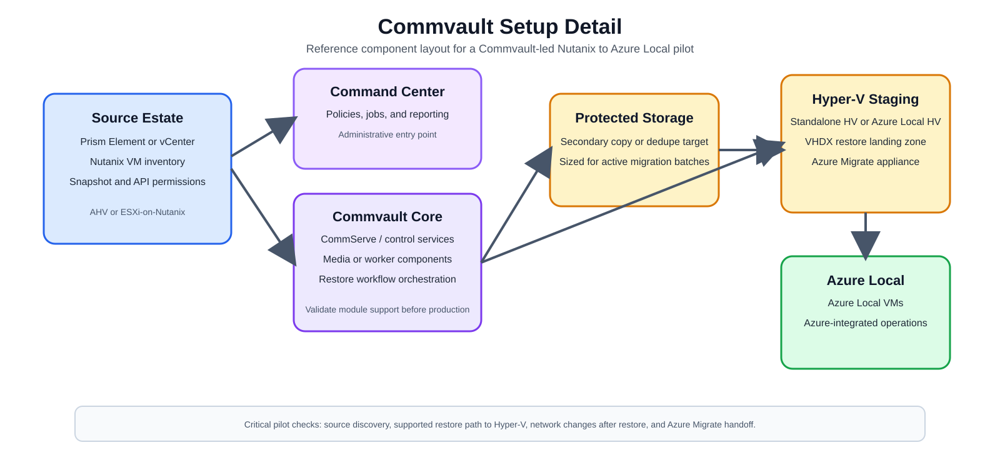

*Control plane, media or worker components, protected storage, Hyper-V staging target, and Azure Migrate handoff.*

### Commvault DrawIO Source

[`diagrams/commvault/migration-diagrams-commvault.drawio`](../assets/diagrams/migration-diagrams-commvault.drawio)

---

## Deploy-First Migration Path {#deploy-first}

### Scenario page detailed architecture

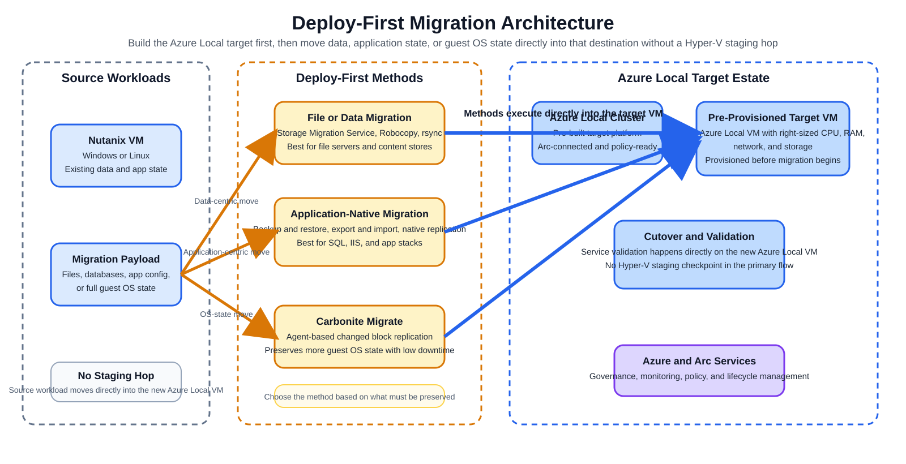

*Scenario-page component diagram: build-first Azure Local target VM, direct migration methods, and no intermediate Hyper-V staging layer in the primary flow.*

[`diagrams/scenarios/04-deploy-first-architecture-detailed.drawio`](../assets/diagrams/04-deploy-first-architecture-detailed.drawio)

### Architecture Overview

The editable draw.io source (open in [app.diagrams.net](https://app.diagrams.net)):  
[`assets/diagrams/migration-diagrams-deploy-first.drawio`](../assets/diagrams/migration-diagrams-deploy-first.drawio)

**Page 1 — Architecture:** Carbonite-based OS-level replication variant inside the broader Deploy-First path. Shows source Nutanix VM → Carbonite → pre-provisioned Azure Local target VM. Contrasts with the Veeam/HYCU/Commvault two-hop pattern (no Hyper-V staging host required).

**Page 2 — Migration Steps:** Eight-step swimlane — Provision target VM, install agents, create job, initial mirror, continuous replication, test failover, cutover, validate and cleanup. Includes timeline bar and when-to-use / when-not-to-use callouts.

---

## Proof of Concept (PoC) Diagrams {#poc}

### PoC Matrix Overview

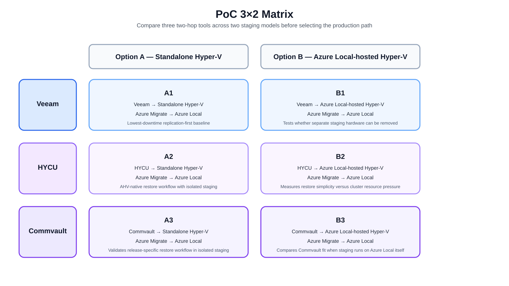

*3×2 matrix: Veeam, HYCU, and Commvault across Option A (standalone Hyper-V) and Option B (Azure Local-hosted Hyper-V).* 

[`diagrams/poc/poc-six-cell-matrix.drawio`](../assets/diagrams/poc-six-cell-matrix.drawio)

### Option A — Standalone Hyper-V

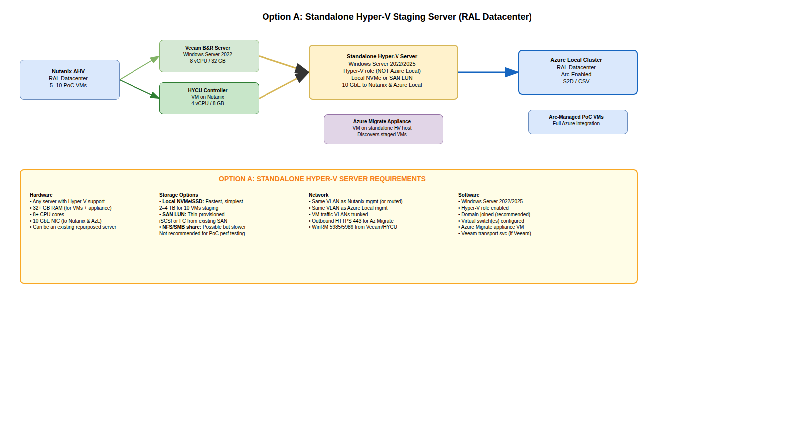

*Dedicated physical or virtual Hyper-V staging host separate from Azure Local.*

### Option B — Azure Local Direct

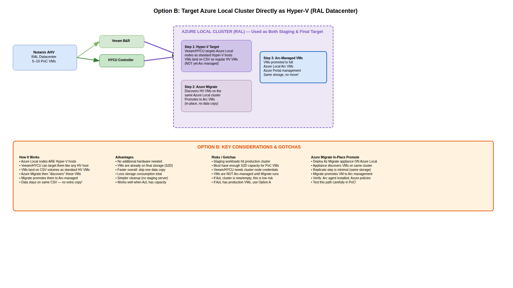

*Azure Local cluster node used as Hyper-V staging target — no separate hardware.*

### PoC Execution and Decision Flow

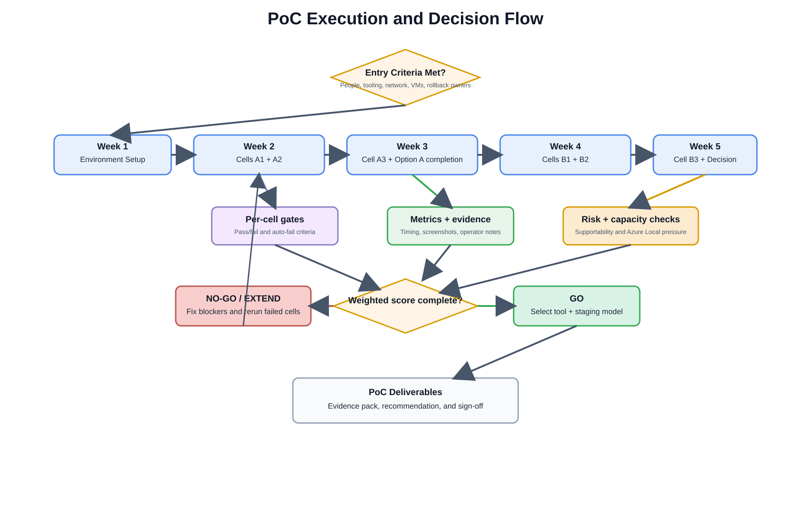

[`diagrams/poc/poc-execution-decision-flow-six-cell.drawio`](../assets/diagrams/poc-execution-decision-flow-six-cell.drawio)

### PoC DrawIO Source

[`diagrams/poc/poc-diagrams.drawio`](../assets/diagrams/poc-diagrams.drawio)
