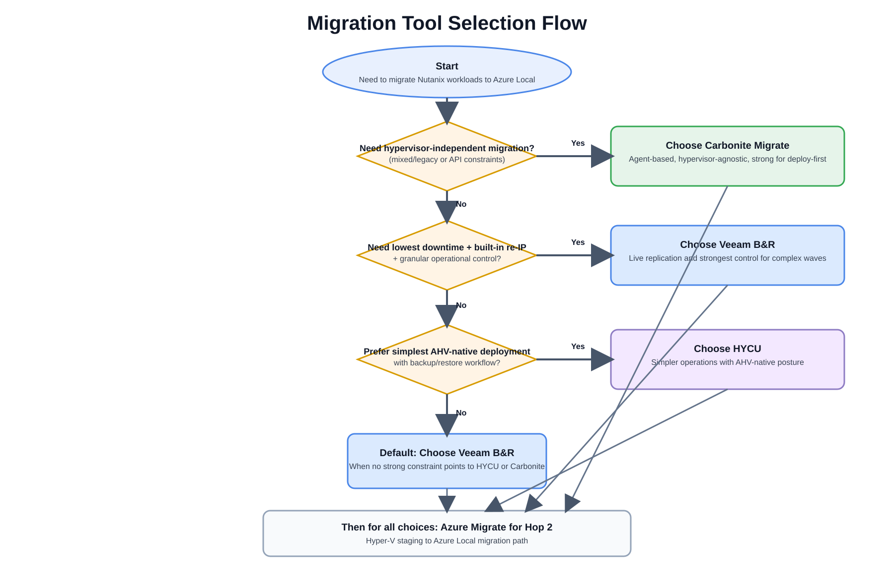
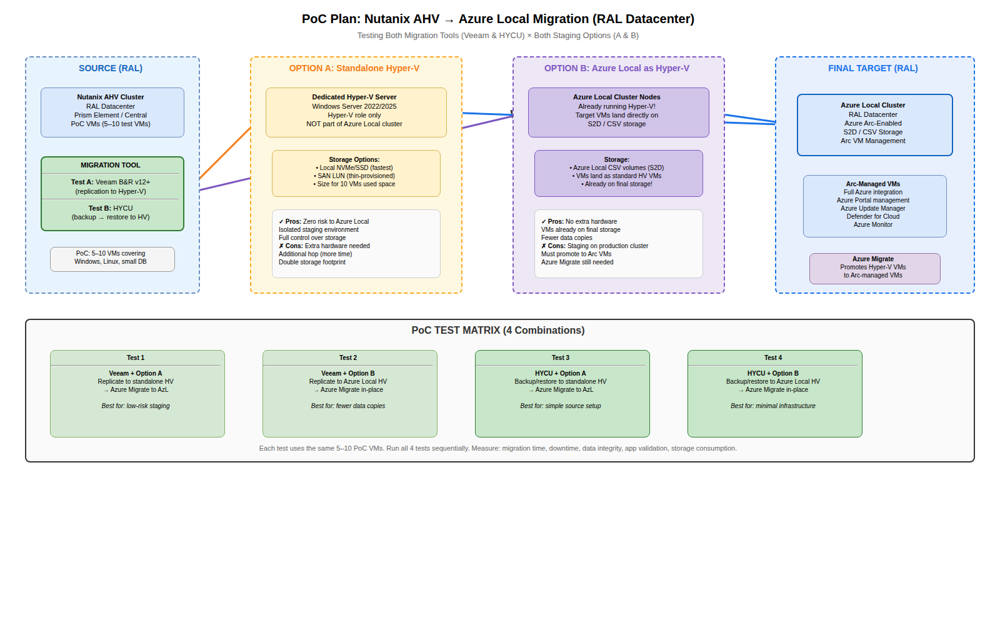
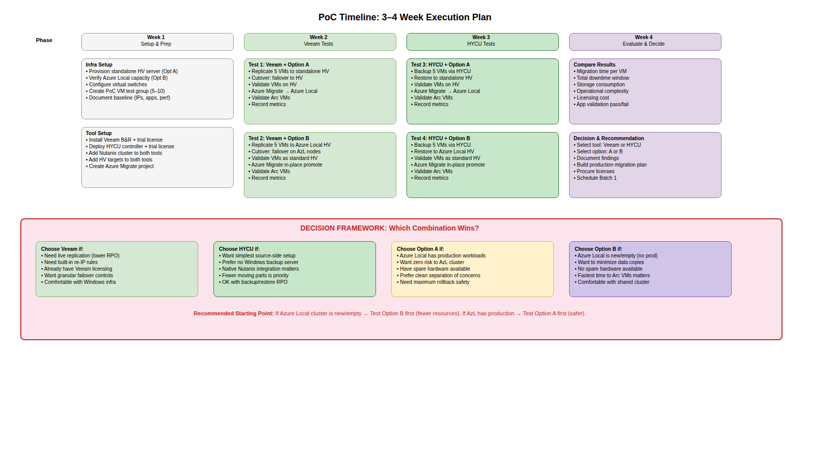

# Diagrams Gallery

> Architecture diagrams for all migration paths.

---

## Common Architecture {#common-architecture}

### Simple Two-Hop Pattern

Tool-neutral architecture for documentation overviews:

Nutanix AHV/ESXi (Source) → Hyper-V Staging (Intermediate) → Azure Local (Target)

### Common Two-Hop DrawIO Source

[`diagrams/common/migration-diagrams-common-two-hop.drawio`](../assets/diagrams/migration-diagrams-common-two-hop.drawio)

### Detailed Two-Hop Architecture

[`diagrams/common/migration-diagrams-common-two-hop-detailed.drawio`](../assets/diagrams/migration-diagrams-common-two-hop-detailed.drawio)

### Migration Phases Overview

[`diagrams/overview/migration-diagrams-phases-overview.drawio`](../assets/diagrams/migration-diagrams-phases-overview.drawio)

### Tool Selection Flow

[`diagrams/overview/migration-diagrams-tool-selection-flow.drawio`](../assets/diagrams/migration-diagrams-tool-selection-flow.drawio)

---

## Veeam Migration Path {#veeam}

### High-Level Architecture

*Two-hop architecture: Nutanix AHV/ESXi → Veeam replication → Hyper-V staging → Azure Migrate → Azure Local.*

### Batch Pipeline Flow

*Sequential batch execution — 10 VMs per batch, Hop 1 cutover before Hop 2 begins.*

### Veeam Setup Detail

*Detailed component diagram: Veeam server, AHV proxy VM, replication jobs, Hyper-V target.*

### Azure Migrate Workflow

*Azure Migrate: appliance discovery → replication → test migration → production cutover → Azure Local VMs.*

### Veeam DrawIO Source

The editable DrawIO source for all Veeam diagrams:  
[`diagrams/veeam/migration-diagrams-veeam.drawio`](../assets/diagrams/migration-diagrams-veeam.drawio)

---

## HYCU Migration Path {#hycu}

### HYCU Setup Detail

*HYCU controller VM on AHV, backup target, Hyper-V restore target, Azure Migrate.*

### HYCU DrawIO Source

[`diagrams/hycu/migration-diagrams-hycu.drawio`](../assets/diagrams/migration-diagrams-hycu.drawio)

---

## Deploy-First Migration Path {#deploy-first}

### Architecture Overview

The editable draw.io source (open in [app.diagrams.net](https://app.diagrams.net)):  
[`assets/diagrams/migration-diagrams-deploy-first.drawio`](../assets/diagrams/migration-diagrams-deploy-first.drawio)

**Page 1 — Architecture:** Source Nutanix AHV cluster with Carbonite agents → continuous replication → pre-provisioned target VMs on Azure Local. Shows initial mirror, delta sync, and cutover flows. Contrasts with the Veeam/HYCU two-hop (no Hyper-V staging host required).

**Page 2 — Migration Steps:** Eight-step swimlane — Provision target VM, install agents, create job, initial mirror, continuous replication, test failover, cutover, validate and cleanup. Includes timeline bar and when-to-use / when-not-to-use callouts.

---

## Proof of Concept (PoC) Diagrams {#poc}

### PoC Overview — Both Options

*2×2 matrix: Veeam/HYCU × Option A (standalone HV) / Option B (Azure Local direct).*

### Option A — Standalone Hyper-V

*Dedicated physical or virtual Hyper-V staging host separate from Azure Local.*

### Option B — Azure Local Direct

*Azure Local cluster node used as Hyper-V staging target — no separate hardware.*

### PoC Timeline and Decision

*Four-week PoC timeline with decision gates at the end of each cell.*

### PoC DrawIO Source

[`diagrams/poc/poc-diagrams.drawio`](../assets/diagrams/poc-diagrams.drawio)
