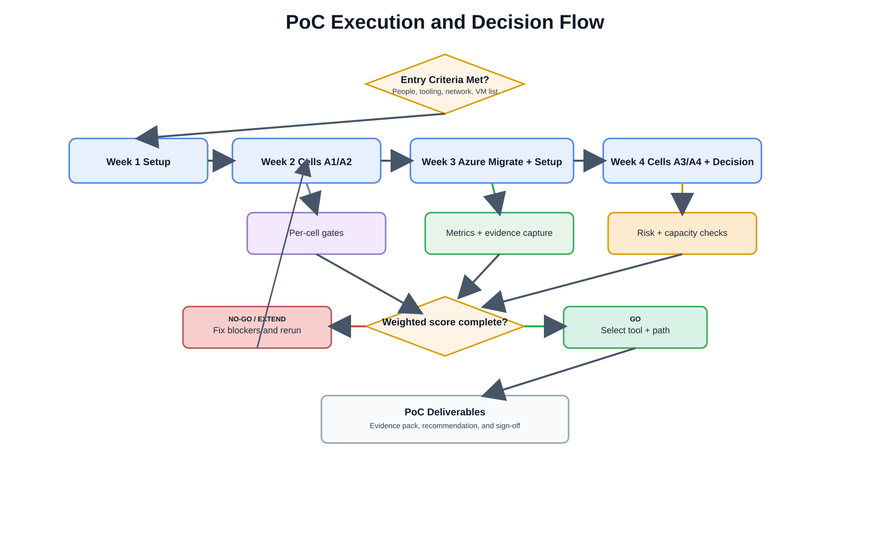

# Proof of Concept (PoC) Plan

> Validate your chosen migration path before committing to a full production migration.

---

## Purpose

The PoC tests **two tools × two staging options** against a small set of representative production VMs. The goal is to choose the best tool+path combination for your environment *before* migrating 300 VMs.

Draw.io source: [poc-execution-decision-flow.drawio](../assets/diagrams/poc-execution-decision-flow.drawio)

## PoC Matrix (2 × 2)

|  | **Option A — Standalone Hyper-V Staging** | **Option B — Azure Local Direct** |
|--|------------------------------------------|----------------------------------|
| **Veeam** | Wave 1 testing: Test cells A1+A2 | Wave 2: A3 |
| **HYCU** | Wave 1 testing: Test cells A1+A2 | Wave 2: A4 |

Each cell = 5 VMs (2 Windows workloads, 2 Linux workloads, 1 SQL Server workload).

See the [Test Matrix](test-matrix.md) for the full breakdown of what is tested in each cell.

## PoC Scope

| Item | Value |
|------|-------|
| Total VMs | 10 representative VMs (5 per tool, some shared) |
| Environments | Nutanix AHV cluster in IIC datacenter |
| Tools tested | Veeam Backup & Replication + HYCU Backup & Recovery |
| Staging options | Standalone Hyper-V (Option A) + Azure Local direct (Option B) |
| Duration | 4 weeks (see [Timeline](timeline.md)) |
| Success threshold | All 10 VMs validated on Azure Local, RTO/RPO metrics documented |

## Entry and Exit Criteria

| Gate | Criteria |
|------|----------|
| **Entry criteria (start PoC)** | 1) Veeam + HYCU environments deployed and licensed, 2) Azure Local target capacity confirmed, 3) Azure Migrate project/appliance healthy, 4) 10 PoC VMs selected and approved, 5) rollback owners assigned |
| **Exit criteria (complete PoC)** | 1) All 4 cells (A1-A4) executed with evidence, 2) weighted scorecard completed, 3) risks and mitigations updated, 4) Go/No-Go decision signed by infra + app owners |

## What the PoC Measures

1. **Migration fidelity** — Do VMs boot cleanly? Are data and applications intact?
2. **Migration speed** — Full backup/replication time, incremental time, cutover time
3. **Tooling complexity** — Is setup and operation straightforward for your team?
4. **Re-IP process** — Does IP/DNS change work reliably for each tool?
5. **Failure rate** — How often do jobs fail and how easily do they recover?

## PoC Success Criteria

| Metric | Pass Threshold |
|--------|---------------|
| VM migration success rate | ≥ 95% (no data corruption, boots clean) |
| Initial full replication time | ≤ 12 hours per 5-VM batch |
| Cutover window (per VM) | ≤ 30 minutes including IP/DNS change |
| Rollback time (per VM) | ≤ 15 minutes back to live on Nutanix |
| Application smoke test | Pass on all validated VMs |

## PoC Risk Register (initial)

| Risk | Probability | Impact | Mitigation | Owner |
|------|-------------|--------|------------|-------|
| Staging storage fills during full sync | Medium | High | Pre-calculate required space + 30% headroom; stop-wave threshold | Infra lead |
| Re-IP/DNS errors at cutover | Medium | High | Pre-stage IP mapping + low TTL + validation script | Network lead |
| Azure Migrate replication lag | Medium | Medium | Start replication earlier; monitor protection state before cutover | Migration lead |
| App-level validation misses hidden dependency | Low | High | Dependency checklist + app-owner test scripts per VM | App owner |
| Tool instability in one cell | Low | Medium | Auto-fail gate + rerun rule + vendor support escalation | PoC manager |

## Required PoC Deliverables

- Completed per-cell gate checklists (A1-A4)
- Metrics workbook with timestamped measurements and operator names
- Evidence pack: screenshots/log extracts for replication, cutover, and validation
- Risk register with final status and accepted residual risk
- Final recommendation deck (selected tool + staging option + rationale)
- Signed Go/No-Go decision record

## Quick Links

- [Test Matrix](test-matrix.md) — test cells, VM selection, what each validates
- [Timeline](timeline.md) — week-by-week execution plan
- [Decision Framework](timeline.md#decision-framework) — how to choose based on PoC results
- [PoC execution flow diagram](../diagrams/index.md#poc) — visual flow and decision gates
